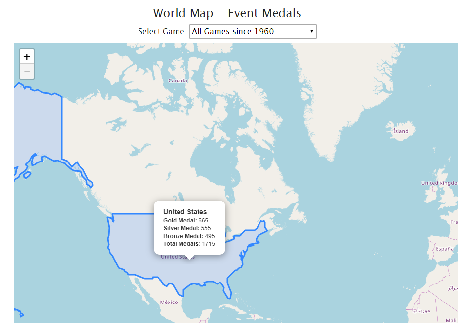
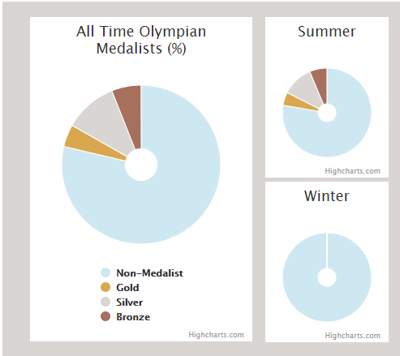
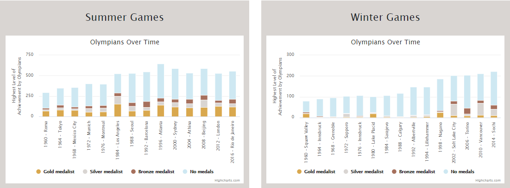
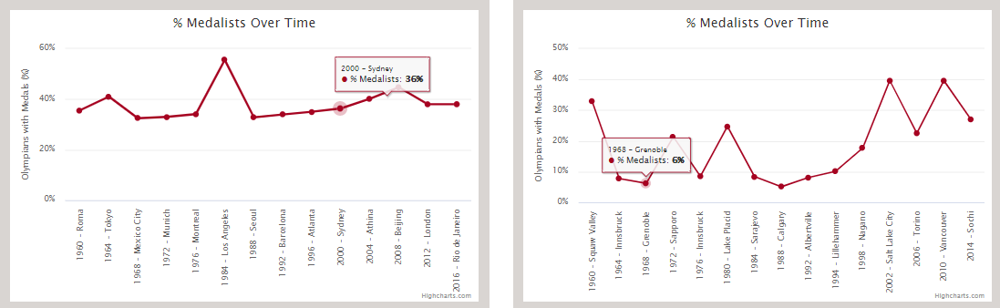
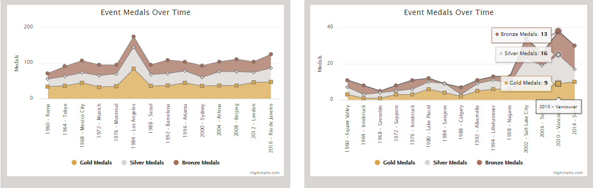
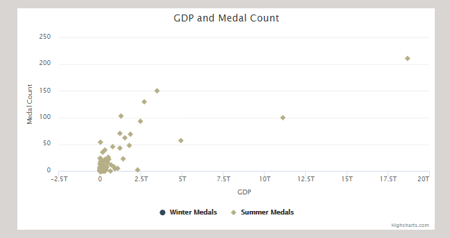
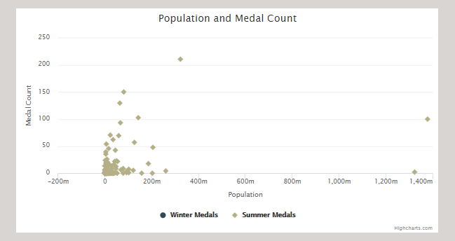
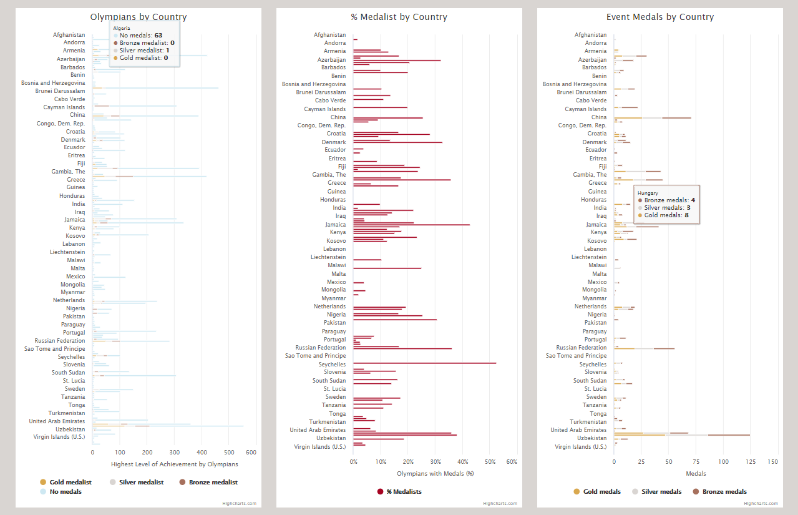

# Olympics Dashboard
[PowerPoint](https://docs.google.com/presentation/d/1BfHcjnQFo2-x0AgD8WOmCmHS4H0LbgmTFrgMlj3o-cc/edit?usp=sharing)

## Dashboard Rationale
This dashboard was developed to review the relevance of population & GDP to countries' performances at the Olympics.
In doing this, we decided to choose a "modern" subset of Olympic Games, ranging from 1960 to 2016 to align with our economic and demographic data. As there is a larger breadth of competing countries in this range and a better record of population and wealth statistics. The term “modern” can be better understood by our Parameters.

### Parameters:
•	Date range is from 1960 to 2016. This reflects the combined data from the World Bank and Olympic Data that overlapped for this project.

•	Country names and boundaries have changed in the last sixty years. As an example: if you are looking for the full Olympic history of a country that was renamed - like Russia - you will need to look for both the Soviet Union and Russia.

•	Not all countries have competed in both the Summer and Winter Olympics, and thus you may see some "blank" graphs due to non-participation.

•	Winter and Summer Olympics were held in the same year until 1992, until they split into separate four-year cycles. The next Winter Olympics was held in 1994.

## Homepage
### Introduction
The introduction includes the purpose of the dashboard as well as the parameters used, as stated above. In addition, we include an “Interesting Fact” related to the Olympic Games that can be updated by the dashboard publicists.
### World Map
The map is a choropleth map based on JavaScript, Leaflet and JSON; featuring a mouse-over feature that presents the medal counts for the hovered-on country based on the filter option selected above the map.

### Participating Countries by Game
The Participating Countries by Game graph provides a static representation of the number of countries that participated in each game presented in this study.

It is worth noting two things:
1)	The increase in participation over time 
2)	The vast difference in participation between the Winter Games vs. the Summer Games.

## Data by Country Page
The Country Page provides the user information to interact with data related to a particular country and its performance in a particular year and game, whether Summer or Winter.

For example: when viewing Jamaica, their medalists will vary greatly from Summer vs Winter games.

Additionally, it provides charts of Olympian counts, % of medalists and Event medalist over each Olympics Game (example: USA).

## Data by Game Page
The Data by Game page delves deeper into the analysis of performance in relation to GDP and Population by reviewing all countries.

From here we can see some correlation in GDP to medal count:

But less of a visual correlation in Population to medal count:

Additionally, the data charts provide a broad area of information in Olympians by Country, % of Medalists by Country, and Event Medals by Country – based on which filter is chosen for Olympics Game (example: Summer 2016 – Rio de Janeiro).

## Observations
What we observed in our visualizations is that there appeared to be a correlation between medal counts and GDP. Which would suggest that further analysis could be done on the statistical significance of this visible correlation.

However, we did not see an apparent correlation between Medal Counts and Population. Which would deter us from further analysis.

## Postmortem

### If we had more time:

#### Wider data pull
We would like to have included a wider amount of data in relation to medal counts, even if keeping the same date window.
For example, the world-map has changed quite a bit since 1960, so there have been a number of countries with name changes, which means there are a number of countries that have been omitted from our data; with exception to Russia -- previously known as the Soviet Union. We found that the Soviet Union had so much data that we included it in our country data chart analysis. But if time permitted, we would have either merged data of obsolete country names or added as many obsolete country names to the data dropdowns as possible, instead of excluding them.

#### Distance from Games
We also would have liked to include visualizations comparing distance traveled to medal count. This idea was sparked when we were playing with our filters and saw there a clear increase in medals for Australia during the Sydney games. Unfortunately, we simply did not have enough time to build the logic or visualizations.

### What we would have done differently:
First, we would have connected the map directly to the flask app. Currently, the map reads from a JSON file that was created from the same dataframe that created the sqlite database that feeds the Flask. So, what this means, is if we were to update the dashboard with Tokyo 2021 data or any other data, both the flask and the json file would need to be updated. Which adds unneeded steps to dashboard updates. (This really could also fall under – IF we had more time).

And second, we would have liked to have planned a better data schema from the start, as we went through a number of iterations throughout the data structuring phase and on the fly during visualization creation as we realized we needed different data than what was available in our flask.